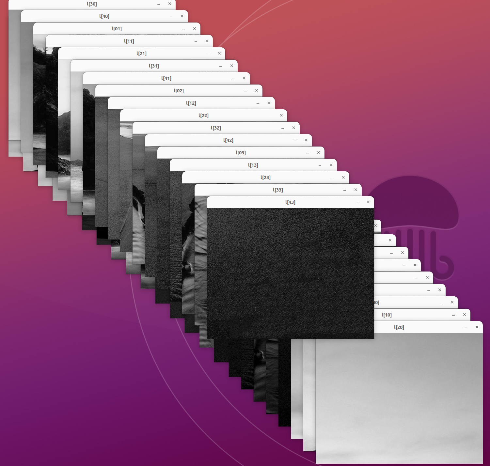

# 基于直方图均衡的LTM实现
* reference：
  [参考论文链接](./arctile/tiant2012.pdf)

* how to compile?

  ```
   cd ./source
   mkdir build && cd build
   cmake ..
   make
  ```
 * how to debug?

  ```
   #define DEBUG 1 //enbale debug info in main.cpp
  ``` 
  
* run result

|index| 原始灰度图| 直方图均衡| LTM     |
| ----|-------- | -------- | -------- |
|0| | |  |
|1| | |  |

* QA：局部颜色单一产生band断层

| 断层图像     |
| --------|
| |