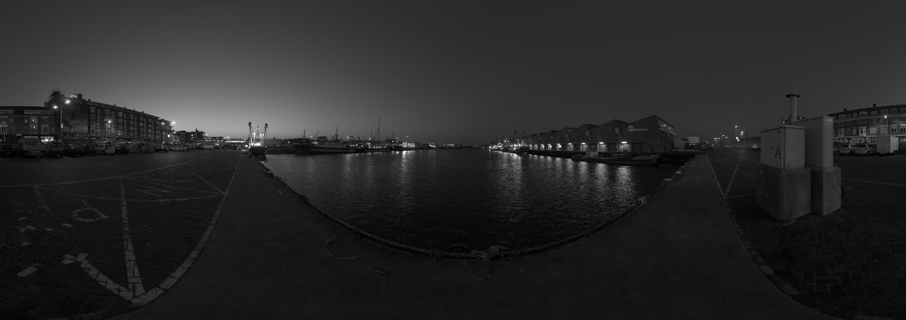

# 基于直方图均衡的LTM实现
* how tocompile?

  ```
   cd ./source
   mkdir build && cd build
   cmake ..
   make
  ```
  
* run result

| 原始灰度图| 直方图均衡| LTM     |
| -------- | -------- | -------- |
| | |  |

* QA：局部颜色单一产生band断层

| 断层图像     |
| --------|
| |